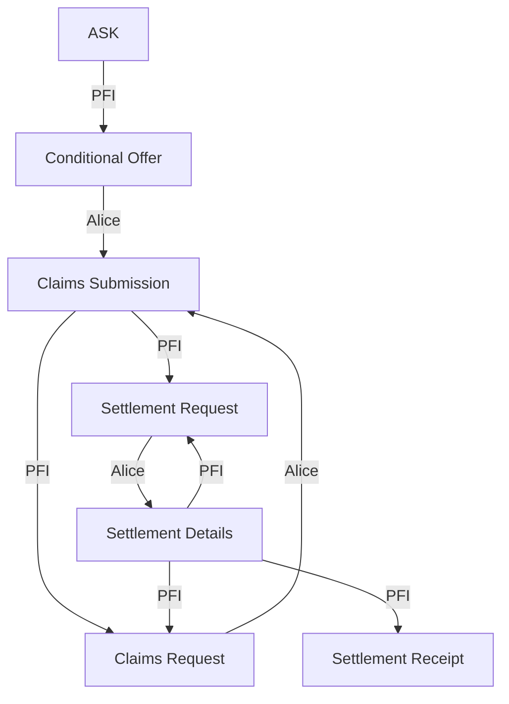

## General Requirements
- The reputability of a PFI is checked **out of band**
- The root message **must** be an ASK

## Transition Diagram
Each Vertex is a message and each edge represents who can transition to a given vertex

_Note: Assume that any vertex can transition to a `CLOSE` by either participant_

## Message Types

### `Ask`
**Description**: 
| field | data type | required | description |
| --- | --- | --- | --- |
| `have.currency` | string | Y | The currency that you currently hold |
| `have.amount` | int | Y | The amount that you currently hold. Amount **must** be in the smallest denomination of said currency |
| `want.currency` | int | Y | the currency that you want |
| `want.amount` | int | N | the **minimum** amount you're looking for |

### `ConditionalOffer`
**Description**: 
| field | data type | required | description |
| --- | --- | --- | --- |

### `ClaimsSubmission`
**Description**: 
| field | data type | required | description |
| --- | --- | --- | --- |

### `ClaimsRequest`
**Description**: 
| field | data type | required | description |
| --- | --- | --- | --- |

### `SettlementRequest`
**Description**: 
| field | data type | required | description |
| --- | --- | --- | --- |

### `SettlementDetails`
**Description**: 
| field | data type | required | description |
| --- | --- | --- | --- |

### `SettlementReceipt`
**Description**: 
| field | data type | required | description |
| --- | --- | --- | --- |

### `CloseThread`
**Description**: 
| field | data type | required | description |
| --- | --- | --- | --- |
| `reason` | string | N | Reason for closing |